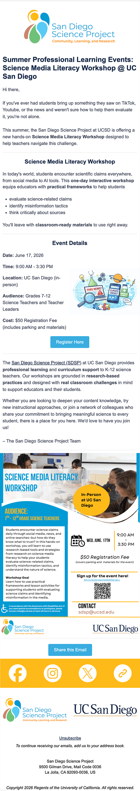
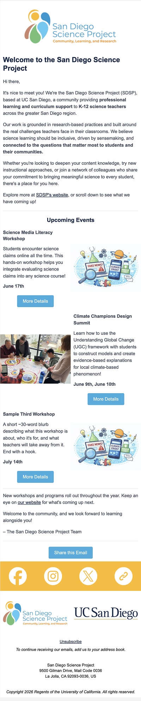

# SDSP Newsletter Resources 

This repository contains MyEmma email marketing resources for the San Diego Science Project from the team at Triton Consulting Group (TCG).

repository link: https://github.com/19tangerines/tcg-sdsp-resources 

## Materials Included:

1. SDSP Workshop Feature Template: an email for featuring one of SDSP's events/workshops. 
   1. Included: a series of drag-and-drop html blocks and an assembly guide. 
   2. Download the `sdsp_workshop_template` folder and follow the guide in `INSTRUCTIONS.md`.
2. SDSP One-Pager Template: an email to give a simple explanation for what SDSP does.
   1. Included: a series of drag-and-drop html blocks and an assembly guide.
   2. Download the `sdsp_onepager_template` folder and follow the guide in `INSTRUCTIONS.md`.

## Visual Samples:

<table>
   <tr>
      <td align="center" valign="top" width="50%">
         
      </td>
      <td align="center" valign="top" width="50%">
         
      </td>
   </tr>
</table>

## Attributions:

Designed and built by Angel Wan · Triton Consulting Group

Original visual design adapted from existing SDSP marketing materials.
Email-platform integration (My Emma) and modular template system by TCG.

**Contact:**

Email: a3wan@ucsd.edu

LinkedIn: [Angel Wan](https://www.linkedin.com/in/angel-wan-035a75380/)

